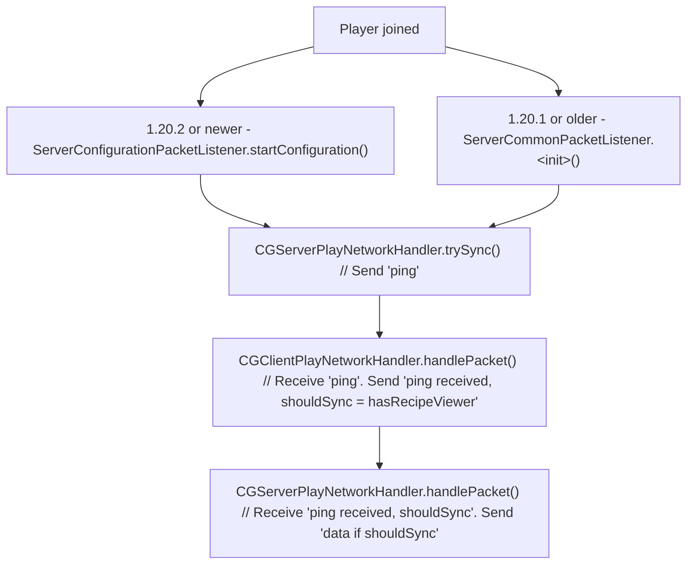

# Networking For Recipe Viewer Integration (Recipe Sync)

## Packet Handling

### Server-side

Custom payloads are intercepted in `mixin/network/ServerCommonPacketListenerMixin.java` to be handled by `CGServerPlayNetworkHandler`, if custom payload are not made by CobbleGen then we let Minecraft (or other mods) handle it.

### Client-side

Custom payloads are intercepted in `mixin/network/ClientCommonPacketListenerMixin.java` to be handled by `CGClientPlayNetworkHandler`, if custom payload are not made by CobbleGen then we let Minecraft (or other mods) handle it.

## Flow

